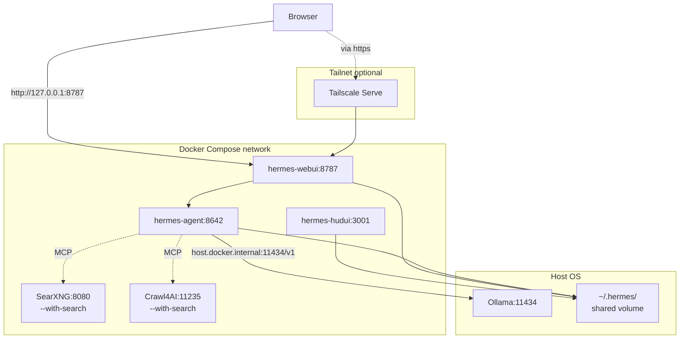
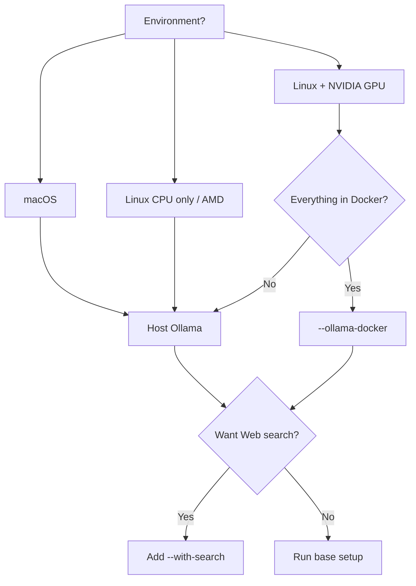

<div align="center">

# Hermes Docker Ollama Template

**A Docker Compose template that runs Hermes Agent + WebUI + HUD UI + local Ollama, safely.**

[](LICENSE)
[](https://docs.docker.com/compose/)
[](https://ollama.com/)
[](https://tailscale.com/)

[](https://github.com/zephel01/hermes-docker-ollama-template/generate)
[](README.en.md)
[](README.md)

[Quick Start](#quick-start) •
[Architecture](#architecture) •
[Install](docs/INSTALL.en.md) •
[Troubleshooting](docs/TROUBLESHOOTING.en.md) •
[FAQ](docs/FAQ.en.md) •
[日本語](README.md)

</div>

---

## Why this template exists

Running Hermes Web UI with Docker and Ollama has several common pitfalls. This template avoids all of them by default.

| Pitfall | How this template handles it |
|---|---|
| `127.0.0.1:11434` does not reach host Ollama from inside Docker | Pre-configured to use `host.docker.internal:11434` |
| `provider: ollama` gets misparsed into `custom:gemma4` | Ollama is registered as a Custom OpenAI-compatible endpoint |
| WebUI shows stale Gemini / GPT / DeepSeek model entries | `model_catalog.enabled: false` by default |
| `hermes-webui` fails on `/tmp` writes | `tmpfs` mount included |
| `hermes-hudui` has no official Dockerfile | Custom Dockerfile bundled |
| MCP host absolute paths break inside the container | MCP disabled by default |
| Accidental LAN / public exposure | Bound to `127.0.0.1`, Tailscale-first design |
| `UID` / `GID` clash with bash builtins / wrong defaults on macOS (501:20) | Renamed to `HOST_UID` / `HOST_GID`, auto-filled by `setup.sh` |
| Hermes alone has no Web search capability | Optional SearXNG + Crawl4AI stack via `compose.search.yml` |

---

## Architecture



> SearXNG and Crawl4AI are optional, enabled only when you pass `--with-search`.

---

## Requirements

- Linux host (Ubuntu / Debian / Arch, etc.) **or** macOS (Apple Silicon / Intel)
- Docker Engine + Docker Compose v2
  - On macOS, use [Docker Desktop](https://www.docker.com/products/docker-desktop/) or [OrbStack](https://orbstack.dev/)
- Git
- [Ollama](https://ollama.com/) installed on the host
- At least one local model (e.g. `gemma4:e4b`)

```bash
ollama pull gemma4:e4b
ollama list
curl http://127.0.0.1:11434/api/tags
```

---

## Which mode should I pick?



`--ollama-docker` and `--with-search` are independent toggles — combine freely.

## Quick Start

**Mode 1: host Ollama (default, recommended on macOS)**

```bash
git clone https://github.com/YOUR_NAME/hermes-docker-ollama-template.git
cd hermes-docker-ollama-template

chmod +x scripts/*.sh
./scripts/setup.sh

docker compose up -d --build
```

**Mode 2: Ollama in Docker (Linux + GPU recommended)**

```bash
./scripts/setup.sh --ollama-docker
docker compose -f docker-compose.yml -f compose.ollama.yml up -d --build

# First-time model pull
docker exec -it ollama ollama pull gemma4:e4b
```

For NVIDIA GPU, uncomment the `deploy.resources` block in `compose.ollama.yml`.

**Mode 3: Enable Web search (SearXNG + Crawl4AI)**

```bash
./scripts/setup.sh --with-search
docker compose -f docker-compose.yml -f compose.search.yml up -d --build
```

See [docs/SEARCH.en.md](docs/SEARCH.en.md). Combinable with `--ollama-docker`.

Endpoints:

| Service | URL | Purpose |
|---|---|---|
| Hermes WebUI | http://127.0.0.1:8787 | Chat UI |
| Hermes HUD UI | http://127.0.0.1:3001 | Agent observability |
| Hermes Agent Gateway | http://127.0.0.1:8642 | API |

---

## Make Ollama reachable from Docker

Containers cannot hit `127.0.0.1:11434` on the host — that resolves to the container itself.
Bind Ollama to all interfaces and use `host.docker.internal:11434/v1` from containers.

<details>
<summary><strong>Linux (systemd)</strong></summary>

```bash
sudo systemctl edit ollama
```

Add:

```ini
[Service]
Environment="OLLAMA_HOST=0.0.0.0:11434"
```

Apply:

```bash
sudo systemctl daemon-reload
sudo systemctl restart ollama
curl http://127.0.0.1:11434/api/tags
```

</details>

<details>
<summary><strong>macOS (Ollama Mac app)</strong></summary>

```bash
launchctl setenv OLLAMA_HOST "0.0.0.0:11434"
```

Then quit Ollama from the menu bar and relaunch it.

Verify:

```bash
curl http://127.0.0.1:11434/api/tags
```

</details>

<details>
<summary><strong>macOS (Homebrew)</strong></summary>

```bash
brew services stop ollama
OLLAMA_HOST=0.0.0.0:11434 brew services start ollama
curl http://127.0.0.1:11434/api/tags
```

Or run manually:

```bash
OLLAMA_HOST=0.0.0.0:11434 ollama serve
```

</details>

> [!WARNING]
> Listening on `0.0.0.0` makes Ollama reachable from your LAN. Combine with Tailscale or restrict port 11434 with `ufw` / `iptables` (Linux) or the macOS firewall.

---

## Default Hermes config

`config/config.yaml.example` is copied to `~/.hermes/config.yaml`:

```yaml
model:
  provider: custom
  default: "gemma4:e4b"
  base_url: "http://host.docker.internal:11434/v1"
  api_key: ""

model_catalog:
  enabled: false
```

> [!IMPORTANT]
> `provider: ollama` has a known issue where the model name gets misparsed (`custom:gemma4`). Registering Ollama as a Custom endpoint is the safe path.

---

## Health check

```bash
./scripts/check.sh
```

Expected:

```text
== Host Ollama ==
[ok] Host Ollama is reachable.

== Docker services ==
NAME            STATUS
hermes-agent    Up
hermes-webui    Up
hermes-hudui    Up

== WebUI -> Ollama ==
{"object":"list","data":[{"id":"gemma4:e4b",...}]}
```

---

## Reset WebUI state

If WebUI keeps showing OpenRouter / Gemini / GPT or stale models:

```bash
./scripts/reset-webui.sh
```

This backs up `~/.hermes/webui` and `~/.hermes/webui-mvp` with a timestamp before rebuilding.

---

## Tailscale access

Expose only inside your tailnet — never the public internet:

```bash
./scripts/tailscale-serve.sh
```

See [docs/SECURITY.en.md](docs/SECURITY.en.md) for details.

---

## Repo layout

```text
hermes-docker-ollama-template/
├── README.md                  (Japanese)
├── README.en.md               (this file)
├── LICENSE
├── CONTRIBUTING.md
├── CHANGELOG.md
├── docker-compose.yml
├── compose.ollama.yml         (override: Ollama-in-Docker mode)
├── compose.search.yml         (override: SearXNG + Crawl4AI Web search)
├── .env.example
├── .gitignore
├── config/
│   ├── config.yaml.example
│   ├── config.yaml.ollama-docker.example
│   └── mcp.yaml.example       (MCP entries for SearXNG / Crawl4AI)
├── searxng/
│   └── settings.yml.example
├── hermes-hudui/
│   └── Dockerfile
├── scripts/
│   ├── setup.sh
│   ├── check.sh
│   ├── reset-webui.sh
│   └── tailscale-serve.sh
├── docs/
│   ├── INSTALL.md             / INSTALL.en.md
│   ├── ARCHITECTURE.md        / ARCHITECTURE.en.md
│   ├── TROUBLESHOOTING.md     / TROUBLESHOOTING.en.md
│   ├── SECURITY.md            / SECURITY.en.md
│   ├── SEARCH.md              / SEARCH.en.md
│   └── FAQ.md                 / FAQ.en.md
└── .github/
    ├── ISSUE_TEMPLATE/
    │   ├── bug_report.yml
    │   └── feature_request.yml
    └── PULL_REQUEST_TEMPLATE.md
```

---

## Documentation

<table>
  <tr>
    <th>Topic</th>
    <th>English</th>
    <th>日本語</th>
  </tr>
  <tr>
    <td>Installation</td>
    <td><a href="docs/INSTALL.en.md">INSTALL.en.md</a></td>
    <td><a href="docs/INSTALL.md">INSTALL.md</a></td>
  </tr>
  <tr>
    <td>Architecture</td>
    <td><a href="docs/ARCHITECTURE.en.md">ARCHITECTURE.en.md</a></td>
    <td><a href="docs/ARCHITECTURE.md">ARCHITECTURE.md</a></td>
  </tr>
  <tr>
    <td>Troubleshooting</td>
    <td><a href="docs/TROUBLESHOOTING.en.md">TROUBLESHOOTING.en.md</a></td>
    <td><a href="docs/TROUBLESHOOTING.md">TROUBLESHOOTING.md</a></td>
  </tr>
  <tr>
    <td>Security</td>
    <td><a href="docs/SECURITY.en.md">SECURITY.en.md</a></td>
    <td><a href="docs/SECURITY.md">SECURITY.md</a></td>
  </tr>
  <tr>
    <td>Web search (SearXNG + Crawl4AI)</td>
    <td><a href="docs/SEARCH.en.md">SEARCH.en.md</a></td>
    <td><a href="docs/SEARCH.md">SEARCH.md</a></td>
  </tr>
  <tr>
    <td>FAQ</td>
    <td><a href="docs/FAQ.en.md">FAQ.en.md</a></td>
    <td><a href="docs/FAQ.md">FAQ.md</a></td>
  </tr>
</table>

---

## Contributing

Issues and pull requests are welcome. See [CONTRIBUTING.md](CONTRIBUTING.md).

## License

[MIT License](LICENSE)

## Credits

- [Hermes Agent](https://github.com/NousResearch/hermes-agent) — Nous Research
- [Hermes Web UI](https://github.com/nesquena/hermes-webui)
- [Hermes HUD UI](https://github.com/joeynyc/hermes-hudui)
- [Ollama](https://ollama.com/)

<div align="center">

**Built for people who just want Hermes + a local LLM to work, today.**

If this saved you time, a Star is appreciated. If you hit a snag, please open an Issue.

</div>
