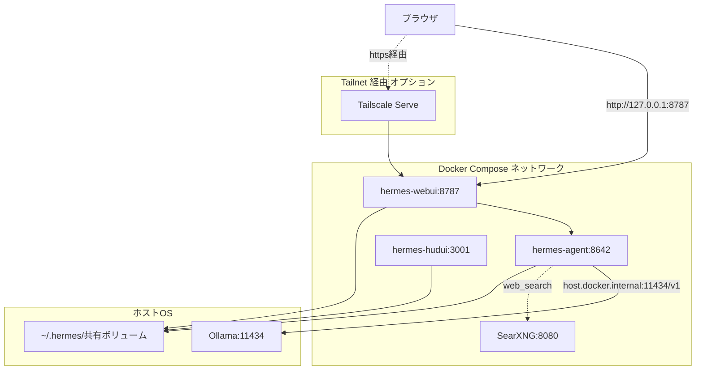
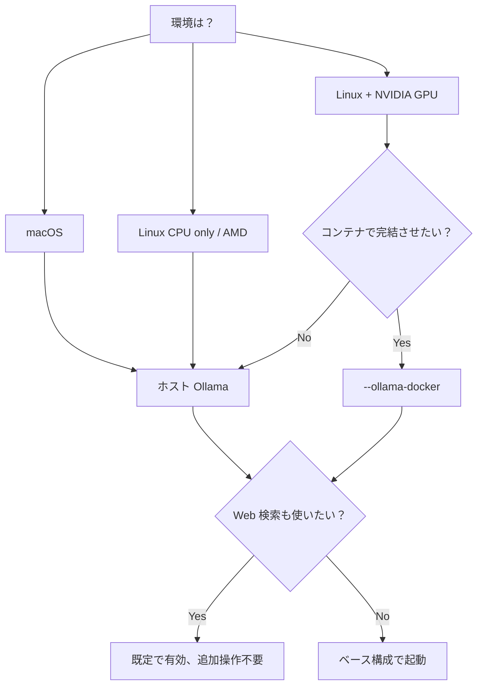

<div align="center">

# Hermes Docker Ollama Template

**Hermes Agent + WebUI + HUD UI + ローカル Ollama を Docker Compose で安全に動かすテンプレート**

[](LICENSE)
[](https://docs.docker.com/compose/)
[](https://ollama.com/)
[](https://tailscale.com/)

[](https://github.com/zephel01/hermes-docker-ollama-template/generate)
[](README.en.md)
[](README.md)

[クイックスタート](#クイックスタート) •
[アーキテクチャ](#アーキテクチャ) •
[インストール](docs/INSTALL.md) •
[トラブルシュート](docs/TROUBLESHOOTING.md) •
[FAQ](docs/FAQ.md) •
[English](README.en.md)

</div>

---

## このテンプレートが解決する問題

Hermes WebUI を Docker と Ollama で動かすときに必ずハマる落とし穴を、最初から避ける構成にしてあります。

| ハマりどころ | このテンプレートでの対策 |
|---|---|
| `127.0.0.1:11434` ではDocker内からホストのOllamaに繋がらない | `host.docker.internal:11434` を最初から設定 |
| `provider: ollama` だと `custom:gemma4` などに化けて落ちる | Custom OpenAI互換endpoint として登録 |
| WebUI に Gemini / GPT / DeepSeek の候補が混ざる | `model_catalog.enabled: false` で抑止 |
| `hermes-webui` が `/tmp` 書き込みでコケる | `tmpfs` をマウント済み |
| `hermes-hudui` 公式 Dockerfile が無い | カスタム Dockerfile 同梱 |
| LAN/インターネットへの誤公開 | `127.0.0.1` バインド + Tailscale前提 |
| `UID` / `GID` がbash予約名と衝突 / macOSで501:20が埋まらない | `HOST_UID`/`HOST_GID` に rename + `setup.sh` で自動置換 |
| Hermes 単体では Web 検索ができない | `docker-compose.yml` に SearXNG を同梱（標準で有効） |

---

## アーキテクチャ



> SearXNG は標準で起動します。Hermes ネイティブの `web_search` ツールがこれを使ってメタ検索を行います。

---

## 動作要件

- Linux ホスト（Ubuntu / Debian / Arch など） **または** macOS（Apple Silicon / Intel）
- Docker Engine + Docker Compose v2
  - macOS は [Docker Desktop](https://www.docker.com/products/docker-desktop/) または [OrbStack](https://orbstack.dev/) を推奨
- Git
- [Ollama](https://ollama.com/) がホストにインストール済み
- 任意のローカルモデル（例: `gemma4:e4b`）

```bash
ollama pull gemma4:e4b
ollama list
curl http://127.0.0.1:11434/api/tags
```

---

## どちらの構成にすべき？



SearXNG は標準で組み込まれているので、追加フラグは不要。`--ollama-docker` のみ環境に応じて選んでください。

## クイックスタート

**モード 1: ホスト Ollama（既定、macOS推奨）**

```bash
git clone https://github.com/YOUR_NAME/hermes-docker-ollama-template.git
cd hermes-docker-ollama-template

chmod +x scripts/*.sh
./scripts/setup.sh

docker compose up -d --build
```

**モード 2: Ollama も Docker化（Linux+GPU推奨）**

```bash
./scripts/setup.sh --ollama-docker
docker compose -f docker-compose.yml -f compose.ollama.yml up -d --build

# 初回モデル取得
docker exec -it ollama ollama pull gemma4:e4b
```

NVIDIA GPU を使う場合は `compose.ollama.yml` の `deploy.resources` ブロックをアンコメントしてください。

**Web 検索について**

SearXNG はベース構成に組み込まれており、上の `setup.sh` / `docker compose up` で標準起動します。追加フラグは不要です。詳しくは [docs/SEARCH.md](docs/SEARCH.md) を参照。

アクセス先:

| サービス | URL | 用途 |
|---|---|---|
| Hermes WebUI | http://127.0.0.1:8787 | チャットUI |
| Hermes HUD UI | http://127.0.0.1:3001 | エージェント可視化 |
| Hermes Agent Gateway | http://127.0.0.1:8642 | API |

---

## Ollama を Docker から見えるようにする

Docker コンテナからは `127.0.0.1:11434` ではホストのOllamaに繋がりません。
Ollama 側を全インターフェースでlistenさせ、コンテナからは `host.docker.internal:11434/v1` で叩きます。

<details>
<summary><strong>Linux (systemd) の場合</strong></summary>

```bash
sudo systemctl edit ollama
```

以下を追記:

```ini
[Service]
Environment="OLLAMA_HOST=0.0.0.0:11434"
```

反映:

```bash
sudo systemctl daemon-reload
sudo systemctl restart ollama
curl http://127.0.0.1:11434/api/tags
```

</details>

<details>
<summary><strong>macOS（Mac アプリ版 Ollama）の場合</strong></summary>

```bash
launchctl setenv OLLAMA_HOST "0.0.0.0:11434"
```

メニューバーから Ollama を Quit → 再起動。

反映確認:

```bash
curl http://127.0.0.1:11434/api/tags
```

</details>

<details>
<summary><strong>macOS（Homebrew 版 Ollama）の場合</strong></summary>

```bash
brew services stop ollama
OLLAMA_HOST=0.0.0.0:11434 brew services start ollama
curl http://127.0.0.1:11434/api/tags
```

または手動起動:

```bash
OLLAMA_HOST=0.0.0.0:11434 ollama serve
```

</details>

> [!WARNING]
> `0.0.0.0` でlistenさせるため、ホストのファイアウォール設定も必ず確認してください。LAN内からも叩けるようになります。Tailscaleを併用するか、`ufw`（Linux）/ macOSファイアウォール等で 11434 を制限してください。

---

## デフォルトの Hermes 設定

`config/config.yaml.example` がそのまま `~/.hermes/config.yaml` にコピーされます。

```yaml
model:
  provider: custom
  default: "gemma4:e4b"
  base_url: "http://host.docker.internal:11434/v1"
  api_key: ""

model_catalog:
  enabled: false
```

> [!IMPORTANT]
> `provider: ollama` を使うとモデル名解釈で `custom:gemma4` に化ける既知問題があります。Custom endpoint として登録するのが安全です。

---

## 接続確認

```bash
./scripts/check.sh
```

正常時の出力イメージ:

```text
== Host Ollama ==
[ok] Host Ollama is reachable.

== Docker services ==
NAME            STATUS
hermes-agent    Up
hermes-webui    Up
hermes-hudui    Up

== WebUI -> Ollama ==
{"object":"list","data":[{"id":"gemma4:e4b",...}]}

== Agent -> Ollama ==
{"object":"list","data":[...]}
```

---

## WebUI の状態をリセットする

WebUI に古いプロバイダ（OpenRouter / Gemini / GPT 等）の候補が残ってしまったら:

```bash
./scripts/reset-webui.sh
```

`~/.hermes/webui` と `~/.hermes/webui-mvp` をタイムスタンプ付きでバックアップしてから再構築します。

---

## Tailscale 経由でアクセスする

公開ポートを開けずに、自分のtailnetからだけアクセスできるようにします。

```bash
./scripts/tailscale-serve.sh
```

詳細は [docs/SECURITY.md](docs/SECURITY.md) を参照してください。

---

## ディレクトリ構成

```text
hermes-docker-ollama-template/
├── README.md                  ← 日本語版（このファイル）
├── README.en.md               ← English version
├── LICENSE
├── CONTRIBUTING.md
├── CHANGELOG.md
├── docker-compose.yml
├── compose.ollama.yml         ← Ollama も Docker化する場合の override
├── .env.example
├── .gitignore
├── config/
│   ├── config.yaml.example
│   ├── config.yaml.ollama-docker.example
├── searxng/
│   └── settings.yml.example
├── hermes-hudui/
│   └── Dockerfile
├── scripts/
│   ├── setup.sh
│   ├── check.sh
│   ├── reset-webui.sh
│   └── tailscale-serve.sh
├── docs/
│   ├── INSTALL.md             / INSTALL.en.md
│   ├── ARCHITECTURE.md        / ARCHITECTURE.en.md
│   ├── TROUBLESHOOTING.md     / TROUBLESHOOTING.en.md
│   ├── SECURITY.md            / SECURITY.en.md
│   ├── SEARCH.md              / SEARCH.en.md
│   └── FAQ.md                 / FAQ.en.md
└── .github/
    ├── ISSUE_TEMPLATE/
    │   ├── bug_report.yml
    │   └── feature_request.yml
    └── PULL_REQUEST_TEMPLATE.md
```

---

## ドキュメント

<table>
  <tr>
    <th>ドキュメント</th>
    <th>日本語</th>
    <th>English</th>
  </tr>
  <tr>
    <td>インストール詳細</td>
    <td><a href="docs/INSTALL.md">INSTALL.md</a></td>
    <td><a href="docs/INSTALL.en.md">INSTALL.en.md</a></td>
  </tr>
  <tr>
    <td>アーキテクチャ</td>
    <td><a href="docs/ARCHITECTURE.md">ARCHITECTURE.md</a></td>
    <td><a href="docs/ARCHITECTURE.en.md">ARCHITECTURE.en.md</a></td>
  </tr>
  <tr>
    <td>トラブルシュート</td>
    <td><a href="docs/TROUBLESHOOTING.md">TROUBLESHOOTING.md</a></td>
    <td><a href="docs/TROUBLESHOOTING.en.md">TROUBLESHOOTING.en.md</a></td>
  </tr>
  <tr>
    <td>セキュリティ</td>
    <td><a href="docs/SECURITY.md">SECURITY.md</a></td>
    <td><a href="docs/SECURITY.en.md">SECURITY.en.md</a></td>
  </tr>
  <tr>
    <td>Web 検索（SearXNG）</td>
    <td><a href="docs/SEARCH.md">SEARCH.md</a></td>
    <td><a href="docs/SEARCH.en.md">SEARCH.en.md</a></td>
  </tr>
  <tr>
    <td>FAQ</td>
    <td><a href="docs/FAQ.md">FAQ.md</a></td>
    <td><a href="docs/FAQ.en.md">FAQ.en.md</a></td>
  </tr>
</table>

---

## コントリビュート

バグ報告・改善提案は Issues / Pull Requests で歓迎します。
詳しくは [CONTRIBUTING.md](CONTRIBUTING.md) を参照してください。

## ライセンス

[MIT License](LICENSE)

## クレジット

- [Hermes Agent](https://github.com/NousResearch/hermes-agent) — Nous Research
- [Hermes Web UI](https://github.com/nesquena/hermes-webui)
- [Hermes HUD UI](https://github.com/joeynyc/hermes-hudui)
- [Ollama](https://ollama.com/)

<div align="center">

**「Hermes + ローカルLLM をまず動かしたい」人のためのテンプレートです**

⭐ 役に立ったら Star を、ハマりどころが見つかったら Issue をお願いします

</div>
