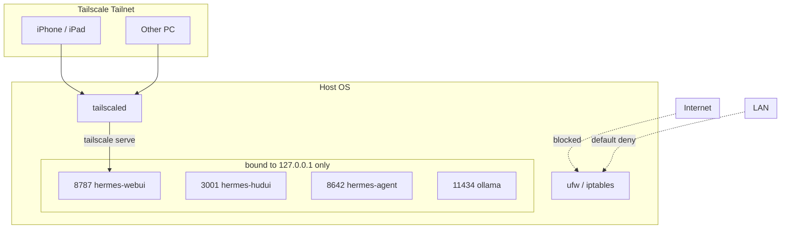

# Architecture

> [日本語版: ARCHITECTURE.md](ARCHITECTURE.md)

## High-level view

```mermaid
flowchart LR
    subgraph Browser[Browser / Client]
        B[Chrome / Safari]
    end

    subgraph Tailnet[Tailscale Tailnet optional]
        TS[tailscale serve<br/>HTTPS]
    end

    subgraph Compose[Docker Compose - hermes-net]
        WebUI[hermes-webui<br/>Port 8787]
        Agent[hermes-agent<br/>Port 8642]
        HUD[hermes-hudui<br/>Port 3001]
    end

    subgraph Host[Host OS]
        Ollama[Ollama<br/>0.0.0.0:11434]
        HermesVol[(~/.hermes<br/>shared volume)]
        Workspace[(~/workspace)]
    end

    B -->|http://127.0.0.1:8787| WebUI
    B -. via https .-> TS --> WebUI

    WebUI -->|HTTP gateway| Agent
    WebUI -. host.docker.internal:11434/v1 .-> Ollama
    Agent -. host.docker.internal:11434/v1 .-> Ollama

    WebUI --- HermesVol
    Agent --- HermesVol
    HUD --- HermesVol
    WebUI --- Workspace
```

---

## Component responsibilities

### hermes-agent

- The Hermes core: calls LLMs and runs tools.
- Started as an HTTP API via `gateway run`.
- Reads `~/.hermes/config.yaml`.
- Exports the `hermes-agent-src` volume so `hermes-webui` can import it as a local package.

### hermes-webui

- Browser-facing chat UI.
- Calls the `hermes-agent` HTTP API.
- Authentication via `HERMES_WEBUI_PASSWORD`.
- State stored under `~/.hermes/webui`.
- Needs writable `/tmp` — provided as `tmpfs`.

### hermes-hudui

- Visualizes agent execution state.
- Reads `~/.hermes` and shows tool call history and session info.
- No official Dockerfile exists upstream — the one in `hermes-hudui/Dockerfile` is provided by this template.

### Ollama (host)

- Local LLM server.
- Bound to `0.0.0.0:11434` (not `127.0.0.1`) so containers can reach it via `host.docker.internal:11434/v1`.
- On Linux, set via systemd `Environment="OLLAMA_HOST=0.0.0.0:11434"`; on macOS, via `launchctl setenv OLLAMA_HOST "0.0.0.0:11434"` or `OLLAMA_HOST=0.0.0.0:11434 ollama serve`.
- Exposes OpenAI-compatible endpoints (`/v1/models`, `/v1/chat/completions`).

---

## Network design



Every port is bound to `127.0.0.1`, blocking direct LAN access.
For remote access, expose **only** the WebUI through `tailscale serve`.

---

## Volume / file layout

```text
Host                                Container
~/.hermes/             <-->  /home/hermes/.hermes        (hermes-agent)
                       <-->  /home/hermeswebui/.hermes   (hermes-webui)
                       <-->  /root/.hermes               (hermes-hudui)
~/workspace/           <-->  /workspace                  (hermes-webui)
hermes-agent-src vol   <-->  /opt/hermes                 (hermes-agent)
                       <-->  /home/hermeswebui/.hermes/hermes-agent (hermes-webui)
```

Sharing `~/.hermes/config.yaml` across all three containers keeps configuration consistent.

---

## Why `provider: custom`?

When you set `provider: ollama`, Hermes parses the model name as `provider:name`. With Ollama-style names like `gemma4:e4b`, this gets misread as `custom:gemma4`, breaking the request.

```yaml
# Fragile
model:
  provider: ollama
  default: "gemma4:e4b"

# Stable
model:
  provider: custom
  default: "gemma4:e4b"
  base_url: "http://host.docker.internal:11434/v1"
  api_key: ""
```

Ollama exposes OpenAI-compatible endpoints under `/v1`, so `provider: custom` works cleanly.
