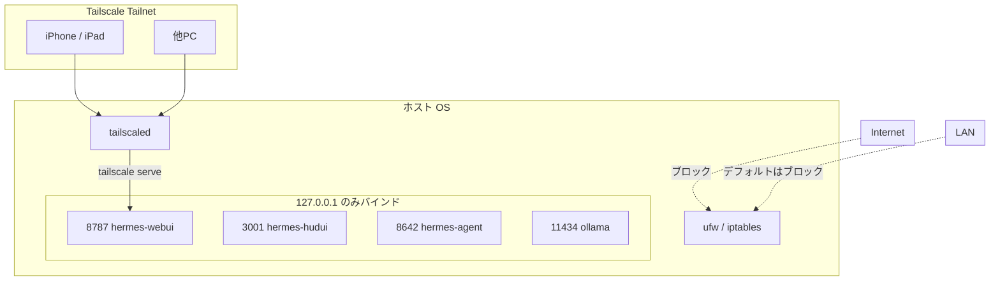

# アーキテクチャ

> [English version: ARCHITECTURE.en.md](ARCHITECTURE.en.md)

## 全体像

```mermaid
flowchart LR
    subgraph Browser[ブラウザ / クライアント]
        B[Chrome / Safari]
    end

    subgraph Tailnet[Tailscale Tailnet オプション]
        TS[tailscale serve<br/>HTTPS]
    end

    subgraph Compose[Docker Compose - hermes-net]
        WebUI[hermes-webui<br/>Port 8787]
        Agent[hermes-agent<br/>Port 8642]
        HUD[hermes-hudui<br/>Port 3001]
        SearXNG[SearXNG<br/>Port 8080<br/>--with-search]
        Crawl4AI[Crawl4AI<br/>Port 11235<br/>--with-search]
    end

    subgraph Host[ホストOS]
        Ollama[Ollama<br/>0.0.0.0:11434]
        HermesVol[(~/.hermes<br/>共有ボリューム)]
        Workspace[(~/workspace)]
    end

    B -->|http://127.0.0.1:8787| WebUI
    B -. https経由 .-> TS --> WebUI

    WebUI -->|HTTP gateway| Agent
    WebUI -. host.docker.internal:11434/v1 .-> Ollama
    Agent -. host.docker.internal:11434/v1 .-> Ollama
    Agent -. MCP .-> SearXNG
    Agent -. MCP .-> Crawl4AI

    WebUI --- HermesVol
    Agent --- HermesVol
    HUD --- HermesVol
    WebUI --- Workspace
```

> SearXNG / Crawl4AI は `compose.search.yml` 有効時にのみ起動するオプションコンポーネントです。詳細は [SEARCH.md](SEARCH.md) を参照してください。

---

## コンポーネント別の役割

### hermes-agent

- Hermes のコア。LLM を呼び出してツール実行を行う。
- `gateway run` で HTTP API として起動。
- `~/.hermes/config.yaml` を読む。
- ボリューム `hermes-agent-src` をエクスポートし、`hermes-webui` がローカルパッケージとしてインポートできるようにする。

### hermes-webui

- ブラウザ向けチャットUI。
- `hermes-agent` の HTTP API を叩く。
- 認証は `HERMES_WEBUI_PASSWORD`。
- 状態は `~/.hermes/webui` に保存される。
- `/tmp` への書き込みが必要なため `tmpfs` をマウント。

### hermes-hudui

- エージェントの実行状態を可視化するHUD。
- `~/.hermes` を読み取り、ツールコール履歴やセッション情報を表示。
- 公式Dockerfileが提供されていないため、本テンプレートが用意したもの（`hermes-hudui/Dockerfile`）でビルドする。

### Ollama (host)

- ローカル LLM サーバ。
- `127.0.0.1:11434` ではなく `0.0.0.0:11434` で listen させ、Docker から `host.docker.internal:11434/v1` で到達できるようにする。
- Linux では systemd の `Environment="OLLAMA_HOST=0.0.0.0:11434"`、macOS では `launchctl setenv OLLAMA_HOST "0.0.0.0:11434"` または `OLLAMA_HOST=0.0.0.0:11434 ollama serve` で設定。
- OpenAI 互換 API (`/v1/models`, `/v1/chat/completions`) を提供。

### SearXNG (オプション、`--with-search` で有効)

- Google / Bing / DuckDuckGo / Brave / Wikipedia 等を裏で叩くメタ検索エンジン。
- `compose.search.yml` 有効時のみ起動し、コンテナ間では `http://searxng:8080` で到達できる。
- `searxng/settings.yml` で `formats: [html, json]` を有効化済み（エージェントが `/search?format=json` を叩けるように）。
- `SEARXNG_SECRET_KEY` は `setup.sh --with-search` が `.env` に 64文字ランダムを書き込む。

### Crawl4AI (オプション、`--with-search` で有効)

- Playwright (Chromium) ベースの LLM フレンドリな Web ページ取得サーバ。
- 動的レンダリング対応。整形済み Markdown を返すので LLM への投入が楽。
- コンテナ間では `http://crawl4ai:11235` で到達。
- 初回起動時に Chromium バイナリ（約 1GB）をダウンロードするため、起動完了まで 1〜3 分かかることがある。

---

## ネットワーク設計



ポートはすべて `127.0.0.1` バインドにすることで、LAN からの直接アクセスを遮断しています。
外部からアクセスしたい場合は、`tailscale serve` 経由で WebUI のみを公開するのが推奨です。

---

## ボリューム / ファイルレイアウト

```text
ホスト                               コンテナ
~/.hermes/             <-->  /home/hermes/.hermes        (hermes-agent)
                       <-->  /home/hermeswebui/.hermes   (hermes-webui)
                       <-->  /root/.hermes               (hermes-hudui)
~/workspace/           <-->  /workspace                  (hermes-webui)
hermes-agent-src vol   <-->  /opt/hermes                 (hermes-agent)
                       <-->  /home/hermeswebui/.hermes/hermes-agent (hermes-webui)
```

`~/.hermes/config.yaml` を3コンテナで共有することで、設定が一致した状態を保証します。

---

## なぜ provider: custom にするのか

`provider: ollama` を指定すると、Hermes 内部で「provider 名 + ":" + モデル名」のパースが走り、
`gemma4:e4b` のように「:」を含むモデル名で `custom:gemma4` として解釈される既知の問題があります。

```yaml
# 落ちやすい例
model:
  provider: ollama
  default: "gemma4:e4b"

# 安定する例
model:
  provider: custom
  default: "gemma4:e4b"
  base_url: "http://host.docker.internal:11434/v1"
  api_key: ""
```

Ollama は OpenAI 互換 API を `/v1` 配下で提供しているため、`provider: custom` で問題なく動作します。
